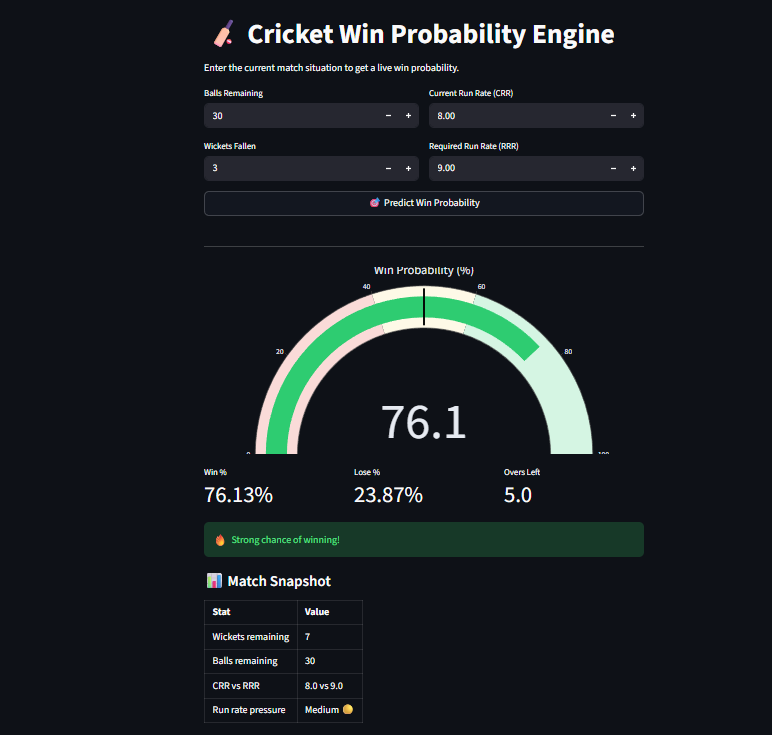

# 🏏 Cricket Win Probability Engine

A machine learning web app that predicts the **live win probability** of a batting team during the 2nd innings of a cricket match — ball by ball.

Built with **XGBoost**, **FastAPI**, and **Streamlit**.

---

## 🔗 Live Demo

👉 [Try the app here](https://cricket-win-probability-engine-da6gj3d22wxnmk7fzdqbba.streamlit.app/) 

---

## 📸 Screenshot



---

## 🧠 How It Works

The model takes 4 inputs about the current match situation:

| Input | Description |
|-------|-------------|
| Balls Remaining | How many balls are left in the innings |
| Wickets Fallen | How many wickets the batting team has lost |
| Current Run Rate (CRR) | Runs scored per over so far |
| Required Run Rate (RRR) | Runs needed per over to win |

It outputs a **win probability (%)** for the batting team, updated after every input change.

---

## 📊 Model Details

- **Algorithm:** XGBoost Classifier
- **Baseline:** Logistic Regression (for comparison)
- **Dataset:** IPL ball-by-ball data (Cricsheet) — 2nd innings only
- **Target:** Did the batting team win? (1 = Yes, 0 = No)
- **Evaluation:** Accuracy ~85%, ROC-AUC ~0.91

---

## 🗂️ Project Structure

```
cricket-win-predictor/
│
├── Cricket Win Probability Engine.ipynb             # Data cleaning, feature engineering, model training
├── app.py                                           # FastAPI backend (REST API)
├── streamlit_app.py                                 # Streamlit frontend (web UI)
├── requirements.txt                                 # All dependencies
├── models/                                          # Saved model (generated after training)
│   └── xgb_model.pkl
└── README.md
```

---

## ⚙️ Run Locally

### 1. Clone the repo
```bash
git clone https://github.com/your-username/cricket-win-predictor.git
cd cricket-win-predictor
```

### 2. Install dependencies
```bash
pip install -r requirements.txt
```

### 3. Get the data
Download `matches.csv` and `deliveries.csv` from [Cricsheet](https://cricsheet.org/downloads/) and place them in the root folder.

### 4. Train the model
Run all cells in `ipl.ipynb` — this saves `models/xgb_model.pkl`

### 5. Run the Streamlit app
```bash
streamlit run streamlit_app.py
```

### 5b. OR run the FastAPI backend
```bash
uvicorn app:app --reload
```
Then visit: `http://localhost:8000/predict?balls_remaining=30&wickets_fallen=3&crr=8.0&rrr=9.5`

---

## 🚀 Deploy (Free)

- **Streamlit app** → [Streamlit Cloud](https://share.streamlit.io) (connect GitHub repo, done)
- **FastAPI** → [Render.com](https://render.com) or [Railway.app](https://railway.app)

---

## 🛠️ Tech Stack

- Python, pandas, numpy
- XGBoost, scikit-learn
- FastAPI, uvicorn
- Streamlit, Plotly

---

## 👤 Author

**Your Name** — [LinkedIn](https://linkedin.com/in/yourprofile) · [GitHub](https://github.com/your-username)
